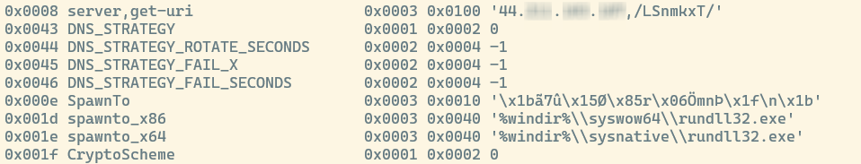

<blockquote class="lf lg lh">
Disclaimer: This blog serves solely for educational purposes. The author advocates for legal and ethical usage and does not support any unauthorized or malicious activities. The content is provided for educational use only, and readers are accountable for their actions and any resulting consequences.
</blockquote>

This blog navigates the complex terrain of cybersecurity, focusing on the advanced tactics in cyberattacks and the key role of digital forensics in analyzing these threats, reflecting a rising trend in cybersecurity risks. It aligns with key cybersecurity topics, notably in computer forensics and anti-forensics, as evidenced by detailed analyses of Cobalt Strike payloads and digital forensic techniques. Additionally, the blog enhances understanding of threat intelligence and the evolution of digital crimes. It also addresses the challenges in analyzing Cobalt Strike beacons, which are designed for evasion and persistence, complicating detection and analysis.

<blockquote class="lf lg lh">
The blog will be structured into two distinct parts: the first will detail the attack scenario, while the second part will focus on digital forensics.
</blockquote>

In my blog, I will offer a brief and clear explanation of Cobalt Strike, outlining its basic functions and significance in cybersecurity. This will serve as an introduction or primer to the topic. For a more detailed exploration, readers can refer to the in-depth blog by my esteemed friend, batchmate, and coworker Mingmar Lama titled “Demystifying Cobalt Strike” which provides a comprehensive analysis of Cobalt Strike and its applications.

<h1>Cobalt Strike</h1>

Cobalt Strike is a commercial penetration testing tool, renowned for its capability to simulate advanced cyber threats. Introduced in 2012 by Raphael Mudge, Cobalt Strike was designed to replicate the tactics, techniques, and procedures (TTPs) used by sophisticated attackers, providing security professionals with a robust platform for assessing the security of networks and systems.

Recently, Advanced Persistent Threat (APT) groups have increasingly used Cobalt Strike. Below are some notable cyber threat incidents involving Cobalt Strike:

<b>APT29 and Cobalt Strike (2018):</b> APT29, a hacking group, used Cobalt Strike in their assaults on the U.S. energy sector. They utilized it for network infiltration, payload execution, and theft of sensitive data, including login credentials and financial information (Mandiant, 2021).

